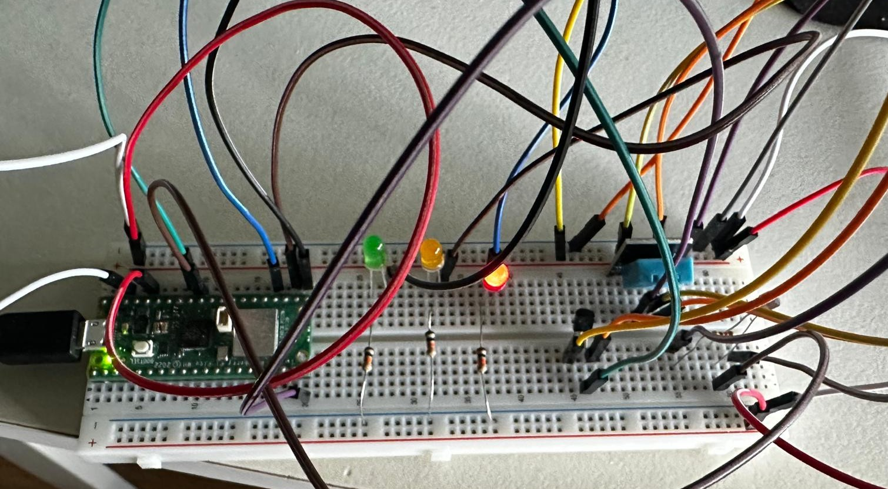

# IoT Sleep Quality Tracker

**Author:** Turhan Ergene, Student mail: te222un@student.lnu.se  
**Course:** IoT Summer Project

---

## 📝 Project Overview

This project is a simple IoT-based sleep quality monitor that uses a Raspberry Pi Pico WH to read environmental data such as temperature, humidity, and light. These values are used to determine how suitable the room is for sleep. The system lights up different LEDs (green, yellow, red) based on the sleep quality score, and the data is visualized on an Adafruit IO dashboard.

**Estimated Time to Complete:** ~4–6 hours, depending on experience with MicroPython and wiring.

---

## 🎯 Objective

I chose to build this project because sleep is essential —especially for those with very sensitive sleep— and is often impacted by subtle environmental factors. This system helps identify patterns and provides feedback to improve the sleep environment.

- **Why this project:** Combines multiple sensor types with real-time evaluation logic.
- **Purpose:** To measure and score room conditions for sleep readiness.
- **Expected Insights:** Whether your room is too hot, humid, or bright for optimal sleep. Also helps build awareness over time via a dashboard.

---

## 🔧 Materials

| Component                 | Purpose                         | Source         |
|--------------------------|----------------------------------|----------------|
| Raspberry Pi Pico WH     | Microcontroller with Wi-Fi       | Electrokit.se  |
| DHT11                    | Humidity and temperature sensor  | Electrokit.se  |
| LM35                     | Analog temperature sensor        | Electrokit.se  |
| CdS Photoresistor (LDR)  | Ambient light detection          | Electrokit.se  |
| LEDs (Green, Yellow, Red)| Indicate sleep quality           | Included       |
| Resistors (330Ω, 10kΩ)   | Voltage drop for LEDs/LDR        | Included       |
| Breadboard               | Prototyping and wiring           | Included       |

🖼️ *See `SleepQualityMeter.jpg` for reference image of wiring setup.*

---

## 💻 Computer Setup

- **PC:** Windows 11
- **IDE Used:** Thonny (Python IDE with MicroPython support)
- **Steps:**
  1. Install Thonny and select MicroPython (Raspberry Pi Pico) as the interpreter.
  2. Connect Raspberry Pi Pico WH via USB.
  3. Flash MicroPython firmware if not already installed.
  4. Upload code using Thonny’s file browser.
  5. Use Thonny's terminal to monitor outputs.

---

## 🔌 Circuit Assembly

### 🖍️ Circuit Diagram



- **DHT11** connected to GPIO 15 (Data), 3.3V and GND.
- **LM35** connected to ADC pin 27.
- **LDR** connected to ADC pin 26 in a voltage divider.
- **LEDs** connected to GPIO 16 (Green), 17 (Yellow), and 18 (Red).
- **Resistors:** 330Ω for LEDs, 4.7 kΩ for LDR voltage divider.


📌 *Use caution with voltage levels.*

---

## 🌐 Platform

The project currently runs locally on the Raspberry Pi Pico WH and sends the data regarding the quality parameter to Adafruit IO.

- **Data points:** Temperature (°C), Humidity (%), Light (%), Sleep Quality (text).
- **Visualization:** Line graphs for sensor values + colored indicator for sleep score.
- **Frequency:** Data is sent every few seconds for live monitoring. Beware that it's not every second due to rate limit of Adafruit.
---

## 🧠 Core Code Functions

```python
def getTemperature():
    millivolts = adc.read_u16()
    adc_12b = millivolts * sf
    volt = adc_12b * volt_per_adc
    temp = (volt - 0.5) * (50 / 0.5)
    return temp

def getLightValue():
    light = ldr.read_u16()
    darkness = round(light / 65535 * 100, 2)
    return darkness

def getHumidity():
    try:
        tempSensor.measure()
        humidity = tempSensor.humidity()
        return humidity
    except Exception as error:
        print("Exception occurred", error)
    time.sleep(2)